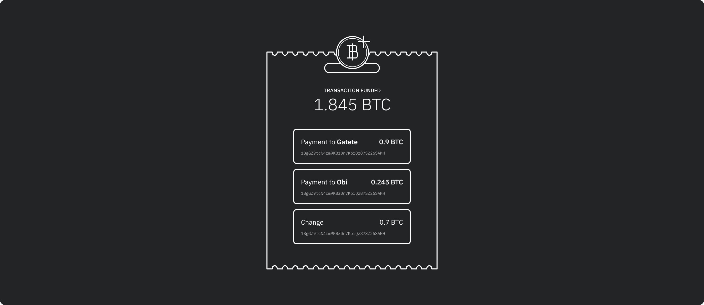

# Transactions



- https://bitcoingraphics.page/

## UTXO

**UTXO** stands for Unspent Transaction (TX) Output.

Every on-chain bitcoin [transaction](https://en.bitcoin.it/wiki/Transaction) sends bitcoin to one or more [addresses](https://en.bitcoin.it/wiki/Address)

, from at least zero (in case of a [coinbase](https://en.bitcoin.it/wiki/Coinbase) transcation) addresses.

A bitcoin [wallet](https://en.bitcoin.it/wiki/Wallet) balance is actually the sum of the UTXOs controlled by the wallet's private keys.

You see, every coin in the Bitcoin ecosystem can only be spent once. So, every bitcoin in a wallet right now is unspent either because:

1. A miner received it as a mining reward, or
2. It was minted during a transaction. *(Remember our example from earlier?)*

```bash
#rpc command
listunspent
```

## UTXO set

> The *UTXO set* is the collection of all addresses with unspent outputs.
>
> Nodes store the UTXO database in RAM, so it’s important to keep the data set at a manageable size. As it grows, the cost of running a full node grows along with it. If running a full node becomes too expensive, we could see further centralization in the Bitcoin network among the wealthy few that can afford to run them. [1]

## Fees

> Transaction fees are also included in transactions and subtracted from the UTXO that you receive as change. The equation looks something like this:
>
> **New UTXO** = (Sum of UTXOs in the transaction) – (Transaction amount) – (Transaction fee)
>
> Continuing our most recent example with a one bitcoin transaction fee:
>
> New UTXO = (17+18) – (35) – (1) = **9 bitcoin**

## Signature

> “Segwit improves the situation here by making signature data, which does not impact the UTXO set size, cost 75% less than data that does impact the UTXO set size. This is expected to encourage users to favour the use of transactions that minimise impact on the UTXO set in order to minimise fees, and to encourage developers to design smart contracts and new features in a way that will also minimise the impact on the UTXO set.”

- https://medium.com/@blairlmarshall/how-does-a-bitcoin-transaction-actually-work-1c44818c3996

## Broadcasting


## Confirmation Times

> chain rewrites
>
> the more confirmations your transactions has, the safer you are

- https://medium.com/@blairlmarshall/how-do-miners-validate-transactions-c01b05f36231

[1]: https://en.bitcoin.it/wiki/UTXO	"UTXO Definition"
[2]: https://coincentral.com/utxo-beginners-explainer/
[3]: https://medium.com/bitbees/what-the-heck-is-utxo-ca68f2651819

[^4]:https://bitcoin.org/en/bitcoin-core/features/validation

